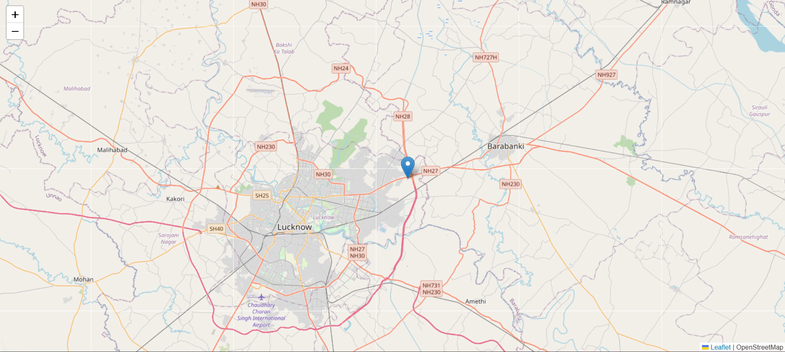

# 🚀 Live Location Tracker

A real-time location tracking web application built using **Node.js**, **Express**, **Socket.IO**, **Leaflet.js**, and the **HTML5 Geolocation API**. It continuously tracks the user's live GPS coordinates and displays the location on an interactive map using OpenStreetMap tiles.

---

## 📌 Features

* 🔴 **Real-time geolocation tracking** using browser GPS
* 🌍 **Interactive map** powered by Leaflet.js & OpenStreetMap
* 🔄 Auto-updates user location on the map
* ⚡ **WebSocket communication** using Socket.IO
* 📡 High accuracy location support
* 📁 Simple & clean project structure

---

## 🛠️ Tech Stack

**Frontend:** HTML, CSS, JavaScript, Leaflet.js
**Backend:** Node.js, Express.js, Socket.IO
**APIs:** HTML5 Geolocation API, OpenStreetMap
**Tools:** Git, GitHub, Nodemon

---

## 📂 Project Structure

```
TrackLive/
│── public/
│   ├── css/
│   │   └── style.css
│   ├── js/
│   │   └── script.js
│── views/
│   └── index.ejs
│── app.js
│── package.json
│── README.md
```

---

## ⚙️ Installation & Setup

### 1️⃣ Clone the repository

```bash
git clone https://github.com/your-username/TrackLive.git
cd TrackLive
```

### 2️⃣ Install dependencies

```bash
npm install
```

### 3️⃣ Start the server

```bash
npx nodemon app.js
```

### 4️⃣ Open in browser

Navigate to

```
http://localhost:3000
```

---

## 📡 How It Works

1. User opens the website
2. Browser asks for **location permission**
3. Geolocation API retrieves live coordinates
4. The client sends coordinates to the server via **Socket.IO**
5. Server broadcasts data
6. Map updates in real-time with the new marker

---

## 🖥️ Screenshots

### 📍 Live Map View


### 📡 Real-time Tracking


---

## 🤝 Contributing

Pull requests are welcome!
Feel free to open an issue for suggestions or improvements.

---

## 📄 License

This project is licensed under the **MIT License**.
